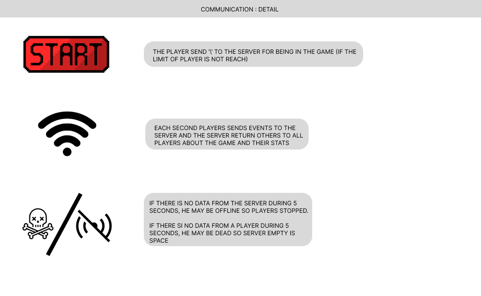
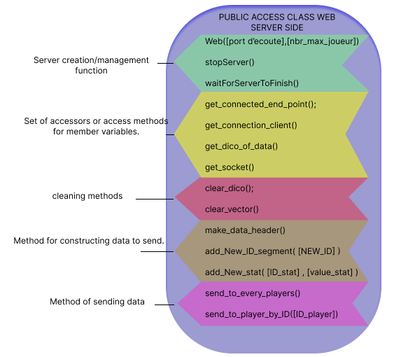
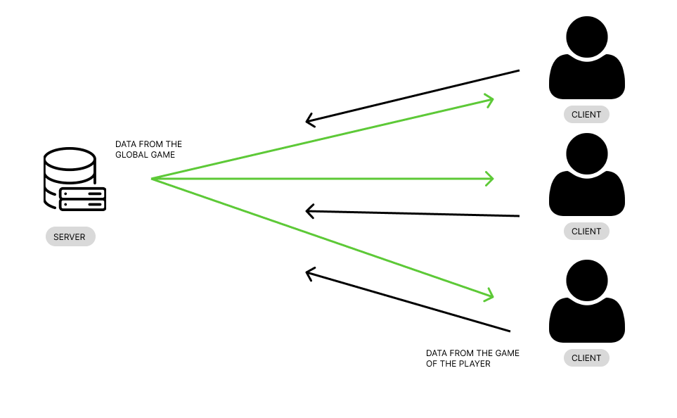
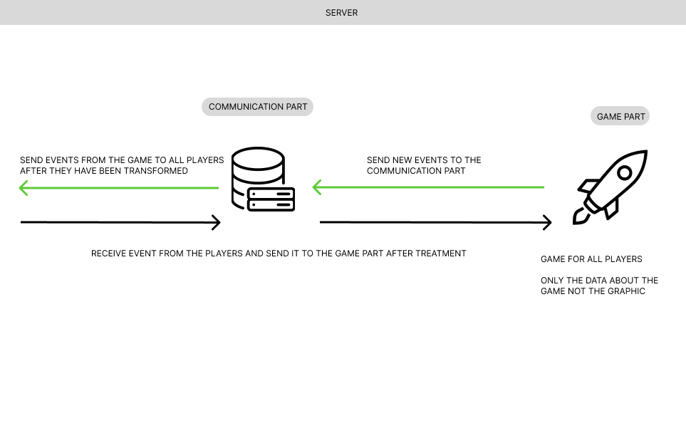
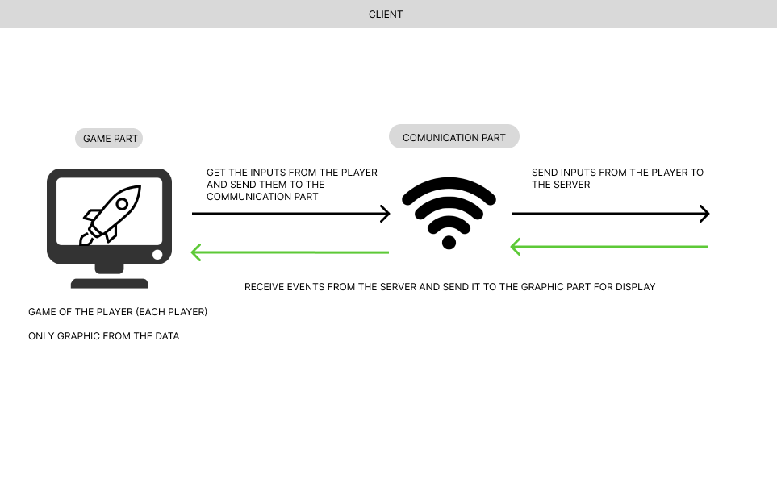

## content table

  

- [Game Engine](#section1)

  

- [ECS](#section2)

  

- [Web Class](#section3)

  

- [GUI](#section4)

  

- [Server part](#section5)

  

- [client part](#section6)

  
  

##  Game Engine

  

The Rtype game engine is designed to provide a solid foundation for creating 2D games. It includes the following features:

- Scene management system for navigation and management of game stages.

- Input management for player control.

  

##  System of Entities-Components (ECS)

  

The ECS system is used for managing entities and components in the game. It favors composition over inheritance and allows great flexibility in creating game entities and behaviors.

  
- Entities: Basic game objects.

- Components: Data attached to entities to define their behavior.

- System: Component-based game logic.

- Entity Manager: Manages entities and their lifecycles.

[ECS documentation](registry.md)

##  Web Class

  

The Web class is responsible for communicating with clients and the server. It allows you to integrate online information, or user management systems.

  

- server creation / Management in UDP protocol.

- Online user authentication and management.

- Data builder and sender.

- User data stockage and managed.

generality graph:

[web class documentation](web.md)

##  Graphics Class (GUI)

  

The graphics class (GUI) manages the game's user interface. It provides tools for creating menus and other graphical elements.
  

- Creation of windows, buttons, progress bars, etc.

- Management of user events.

- Customization of appearance and animations.

[GUI documentation](gui.md)
  

##  Server part

  

The server part of the project manages the game's business logic, data persistence, user authentication and session management.

  

- Multiplayer game server.

- Database for storing player profiles and scores.

- User authentication.

  

##  Client part

  

The client side is responsible for the players' gaming experience. It communicates with the server, manages the user interface and renders the game using the game engine and graphics class.

  

- Game user interface.

- Communication with the server.

- Management of player inputs.

  

## Conclusion

  

The Rtype project is a complex application that combines many components. This documentation should serve as a guide for developers who want to contribute to the project and for users who want to understand how it works.

  

Feel free to consult the technical documents and code examples for a more detailed understanding of each component.