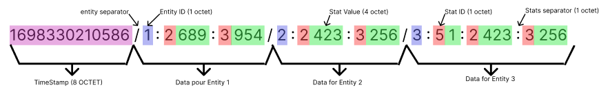

#  Web Class documentation

The `Web` class is a C++ class which inherits from the `IWeb` interface and allows you to manage network communications for a server. This documentation describes the methods and their functionality within the `Web` class.

## Data building

A data is constituate of multiple segment, the firste one, the header, basicaly a timestamps in 8 bite at the begining of the data , and the Entitys segments, constituate of multiple layer of Entity information. The protocol of communication and so data builder is made as generic as possible, so it can be use and adapt in all environnement.

### exemple of data 

Here we have a exemple of data withe :

In this exemple we can find 3 Entity layer , the Entity one and two have eache one 2 statistic with the same ID but with differante value and the third entity have 3 statistic, the same first two as the other and a new third. With that, the information can be interpreted differantly, it will depand to the meaning of the statistic ID. 

But here the data is send by our Rtype server to all his client, so we know this statistic ID:

1. ID **1** is for the **life statistic** (not presente here)

2. ID **2** is for the **x axis** position of the entity

3. ID **3** is for the **y axis** position o the entity

4. ID **4** is for the **shooting action** of a entity

5. ID **5** is for the **sprite selection** of the entity (allocated when it's first spawn)

So we therefore know that in this data, their is a update of the x and y position for 3 entity, and one of them have a spécified sprite, so the third has just been created.

## Builder

### Web(int port, int nbr_max_joueur)

This constructor initializes a web server by listening on a specified port and allowing a maximum number of players.

- `port` : The port number the server will listen on
- `nbr_max_joueur` : The maximum number of players allowed.

## Methods for Customer Management

### std::map<int, udp::endpoint> get_connected_end_point()

This method returns a dictionary of connected clients. The dictionary is in the format `[Client_ID] = connection information (endpoint)`.

### std::vector<int> get_connection_client()

Returns a vector containing the IDs of all clients that have performed or redone a connection protocol, then clears the vector.

### void clear_vector()

This method resets the list of bytes to send.

## Server Management

### void stopServer()

This method allows threads and data flow to be closed.

### void waitForServerToFinish()

Waiting for threads to close.

## Handling the Byte List

### std::vector<uint8_t> get_socket()

Returns the current list of bytes to send.

### void make_data_header()

This method adds a header to the byte list, consisting of 13 bytes and a timestamp.

## Gestion des Segments d'Entités

### void add_New_ID_segment(int id)

Adds a new entity segment to the byte list in the format `[/][ID_ENTITY]`.

### void add_New_stat(int ID_stat, int value_stat)

Adds a new statistic to the entity in the byte list in the format `[:][ID_COMPONENT][*][*][*][*]` ([*] = component value).

## Sending Data to Customers

### int send_to_every_players()

Sends the current byte list to all connected clients, then resets the list. Returns 0 on success, otherwise 84.

### int send_to_player_by_ID(int ID_player)

Sends the current byte list to a client with the matching ID, then resets the list. Returns 0 on success, otherwise 84.

## Management of Customer Requests

### std::vector<DataSegment> get_dico_of_data();

Returns a vector containing all queries sent by clients, sorted into dictionaries.

These methods allow you to efficiently manage network connections and communications for a server using the `Web` class.

### allEntity get_all_entity_saves();

### bool suppr_stat_inEntity(int ID_entity, int ID_stat);

[return to README](../README.md)
